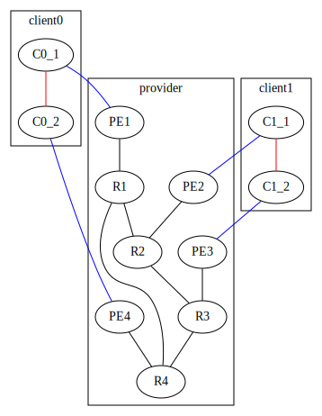
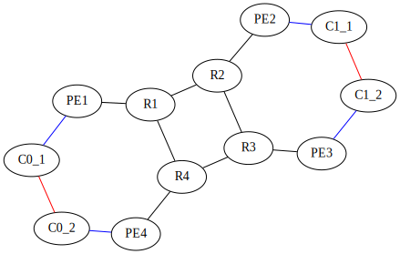

# NAS

## Scripts

1. *Optionnel* `initialconfig.py`: Crée une config initiale à partir d'une description de mapping physique json.

```sh
python initialconfig.py physical_mapping.json > myconfig.gviz
```

2. Editer `myconfig.gviz`, ex: rajouter des clients

3. `main.py`: Crée les configs routeurs à partir de la config.

```sh
python main.py myconfig.gviz physical_mapping.json
```

Ou si pas de mapping physique :

```sh
python main.py myconfig.gviz 
```

4. `gns3topo.py`: Crée la topologie dans GNS3 à partir du mapping physique.



